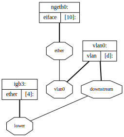

# About

This repository includes notes on using your own OPNsense hardware with AT&T Fiber. This method utilizes [`netgraph`](https://www.freebsd.org/cgi/man.cgi?netgraph(4)), a graph based kernel networking subsystem of FreeBSD, and `wpa_supplicant`. This "supplicant" method eliminates the need for the AT&T Residential Gateway entirely.

# Background

While many AT&T Residential Gateways offer something called _IP Passthrough_, it does not provide the same advantages of a true bridge mode. For example, the NAT table is still managed by the gateway, which is limited to a measly 8192 sessions (although it becomes unstable at even 60% capacity)<sup>[citation needed]</sup>.

The supplicant method will allow you to fully utilize your own router and fully bypass your Residential Gateway. It survives reboots, re-authentications, IPv6, and new DHCP leases.

## How it Works

Before continuing to the setup, it's important to understand how this method works. This will make configuration and troubleshooting much easier.

### Standard Procedure

First, let's talk about what happens in the standard setup (without any bypass). At a high level, the following process happens when the gateway boots up:

1. All traffic on the ONT is protected with [802.1/X](https://en.wikipedia.org/wiki/IEEE_802.1X). So in order to talk to anything, the Router Gateway must first perform the [authentication procedure](https://en.wikipedia.org/wiki/IEEE_802.1X#Typical_authentication_progression). This process uses a unique certificate that is hardcoded on your Residential Gateway.
2. Once the authentication completes, you'll be able to properly "talk" to the outside. However, all of your traffic will need to be tagged with VLAN ID 0 (a.k.a. VLAN Priority Tagging<sup>[[1]](https://wikipedia.org/wiki/IEEE_802.1Q#Frame_format)[[2]](https://www.cisco.com/c/en/us/td/docs/switches/connectedgrid/cg-switch-sw-master/software/configuration/guide/vlan0/b_vlan_0.html)</sup>) before the IP gateway will respond.  
3. Once traffic is tagged with VLAN ID 0, your Residential Gateway needs to request a public IPv4 address via DHCP. The MAC address in the DHCP request needs to match that of the MAC address that's assigned to your AT&T account<sup>[citation needed]</sup>. Other than that, there's nothing special about the DCHPv4 handshake.
4. After the DHCP lease is issued, the WAN setup is complete. Your LAN traffic is then NAT'd and routed to the outside.

### Bypass Procedure

To bypass the Residential Gateway using OPNsense, we can emulate the standard procedure entirely within OPNsense. However, there is a complication; tagging traffic with VLAN ID 0 is not supported through the standard interfaces.

This is where `netgraph` comes in. `netgraph` allows you to break some rules and build the proper plumbing to make this work. In our case, it simply allows us to tag traffic with VLAN ID 0.

Hopefully, that gives you an idea of what we are trying to accomplish. See the comments and commands in [`bin/opnatt.sh`](bin/opnatt.sh) for details about the netgraph setup.

# Setup

## Prerequisites

* Certificates extracted from your Arris NVG589, NVG599, BGW210-700, or Pace 5268AC.
* The MAC address tied to your certificates.
* Local or console access to OPNsense.

There are some excellent resources on rooting and extracting certificates from various gateways:
* [BGW210-700: Rooting an AT&T Fiber Gateway](https://www.dupuis.xyz/bgw210-700-root-and-certs) by [Andrew Dupuis](https://www.dupuis.xyz) [[Wayback Machine]](https://web.archive.org/https://www.dupuis.xyz/bgw210-700-root-and-certs) [[archive.ph]](https://archive.ph/wiT7T)
* [bypassrg/att](https://github.com/bypassrg/att)
* [EAP-TLS credentials decoder for Nokia, Humax, Motorola and Arris gateways. Ultimate fiber router bypass!](https://www.devicelocksmith.com/2018/12/eap-tls-credentials-decoder-for-nvg-and.html) by [Sergey AKA devicelocksmith](https://www.devicelocksmith.com) [[Wayback Machine]](https://web.archive.org/https://www.devicelocksmith.com/2018/12/eap-tls-credentials-decoder-for-nvg-and.html) [[archive.ph]](https://archive.ph/SNALp)
* [SharknAT&To](www.nomotion.net/blog/sharknatto)<sup>[broken]</sup> by jhutchins/NoMotion [[Web Archive]](https://web.archive.org/http://www.nomotion.net/blog/sharknatto) [[archive.ph]](https://archive.ph/JS6rA)
* [Rooting The NVG510 from the WebUI](http://earlz.net/view/2012/06/07/0026/rooting-the-nvg510-from-the-webui) by Ashley Houston AKA ash2q [[Web Archive]](https://web.archive.org/http://earlz.net/view/2012/06/07/0026/rooting-the-nvg510-from-the-webui) [[archive.ph]](https://archive.ph/wtRql)

## Install

1. Download/clone this repo somewhere you can edit it.

2. Copy your certificates somewhere they can be accessed by the script, such as the `wpa` directory.

3. Edit the configuration variables in `bin/opnatt.conf` to your setup.
```shell
# Interface Options

ONT_IF="xx0"
EAP_IDENTITY="XX:XX:XX:XX:XX:XX"
RG_ETHER="XX:XX:XX:XX:XX:XX"

# wpa_supplicant Options

ca_cert="/conf/opnatt/wpa/ca.pem"
client_cert="/conf/opnatt/wpa/client.pem"
private_key="/conf/opnatt/wpa/private.pem"
```

4. Copy the repo to `/conf/opnatt`:
```shell
scp -r opnatt root@OPNsense:/conf/
```

5. At this point testing the script would be a good idea.
```shell
ssh root@OPNsense
/conf/opnatt/bin/opnatt.sh
```

6. To start `opnatt` at boot:
```shell
ln /conf/opnatt/bin/opnatt.sh /usr/local/etc/rc.syshook.d/early/99-opnatt
```

7. Assign `ngeth0` as your WAN interface.

8. Once again, it's recommended to reboot OPNsense to test that WAN comes up.

9. Apply your configurations, firewall rules, etc. in OPNsense.
   Do *not* add the underlying interface (`xx0`) to OPNsense.

# IPv6 Setup

Big thanks to @pyrodex1980's [post](http://www.dslreports.com/forum/r32118263-) on DSLReports for notes on IPv6.

**WAN Setup**

1. Go to _Interfaces > WAN_
1. Enable **IPv6 Configuration Type** as _DHCP6_
1. Scroll to _DCHP6 Client Configuration_
1. Enable **Request only an IPv6 prefix**
1. Enable **DHCPv6 Prefix Delegation size** as _60_
1. Enable _Send IPv6 prefix hint_
1. Enable _Do not wait for a RA_
1. Save

**LAN Setup**

1. Go to _Interfaces > LAN_
1. Change the **IPv6 Configuration Type** to _Track Interface_
1. Under Track IPv6 Interface, assign **IPv6 Interface** to your WAN interface.
1. Configure **IPv6 Prefix ID** to _0_. You *CAN* use IPv6 Prefix id 0, as OPNSense does *NOT* assign a routeable IPv6 address to ngeth0
1. Save

If you have additional LAN interfaces repeat these steps for each interface except be sure to provide an **IPv6 Prefix ID** that is not _0_ and is unique among the interfaces you've configured so far.

**DHCPv6 Server & RA**

1. Go to _Services > DHCPv6 Server & RA_
1. Enable DHCPv6 server on interface LAN
1. Configure a range of ::0001 to ::ffff:ffff:ffff:fffe
1. Leave **Prefix Delegation Range** _blank_.
1. Configure **Prefix Delegation Size** to _64_
1. Save
1. Go to the _Router Advertisements_ tab
1. Configure **Router mode** as _Stateless DHCP_
1. Save

If you have additional LAN interfaces repeat these steps for each interface.

That's it! Now your clients should be receiving public IPv6 addresses via DHCP6.

# Troubleshooting

## Logging

Output from `opnatt.sh` can be found in the OPNsense Web UI under System -> Log Files -> General.

## `wpa_supplicant`

Connect to the `wpa_supplicant` daemon and view status:
```shell
wpa_cli status
```

## `tcpdump`

Use tcpdump to watch authentication, VLAN and DHCP traffic.
```
tcpdump -ei $ONT_IF
```


Verify you are seeing 802.1Q (tagged as vlan0) traffic on your `$ONT_IF ` interface and untagged traffic on `ngeth0`.

Verify the DHCP request is firing using the MAC address of your Residential Gateway.

If the VLAN0 traffic is being properly handled, next OPNsense will need to request an IP. `ngeth0` needs to DHCP using the authorized MAC address. You should see an untagged DCHP request on `ngeth0` carry over to the `$ONT_IF` interface tagged as VLAN0. Then you should get a DHCP response and you're in business.

If you don't see traffic being bridged between `ngeth0` and `$ONT_IF`, then netgraph is not setup correctly.

## Promiscuous Mode

`opnatt.sh` will put `$ONT_IF` in promiscuous mode via `/sbin/ifconfig $ONT_IF promisc`. It's unclear if this is required or not in supplicant mode.

## Kernel Modules

Confirm the required kernel modules are loaded with `kldstat`. The following modules are required:

- `netgraph`
- `ng_ether`
- `ng_eiface`
- `ng_vlan`

You can edit which kernel modules are loaded by opnatt.sh in [`opnatt.conf`](bin/opnatt.conf).

## `netgraph`

The netgraph system provides a uniform and modular system for the implementation of kernel objects which perform various networking functions. If you're unfamiliar with netgraph, this [tutorial](http://www.netbsd.org/gallery/presentations/ast/2012_AsiaBSDCon/Tutorial_NETGRAPH.pdf) is a great introduction.

Your netgraph should look something like this:



In this setup, the `igb3` interface is my `$ONT_IF`.

You can generate your own graphviz via `ngctl dot`. Copy the output and paste it at [webgraphviz.com](http://www.webgraphviz.com/) or render locally with `dot`.

Try these commands to inspect whether netgraph is configured properly.

1. Issue `ngctl list` to list netgraph nodes. Inspect `opnatt.sh` to verify the netgraph output matches the configuration in the script. It should look similar to this:

|               |               |               |               |
|---------------|---------------|---------------|---------------|
| Name: igb3    | Type: ether   | ID: 00000004  | Num hooks: 1  |
| Name: vlan0   | Type: vlan    | ID: 0000000d  | Num hooks: 2  |
| Name: ngeth0  | Type: eiface  | ID: 00000010  | Num hooks: 1  |

2. Inspect the various nodes and hooks:

- `igb3`:

| Local hook    | Peer name | Peer type | Peer ID   | Peer hook     |
|---------------|-----------|-----------|-----------|---------------|
| lower         | vlan0     | vlan      | 0000000d  | downstream    |

- `vlan0`:

| Local hook    | Peer name | Peer type | Peer ID   | Peer hook |
|---------------|-----------|-----------|-----------|-----------|
| vlan0         | ngeth0    | eiface    | 00000010  | ether     |
| downstream    | igb3      | ether     | 00000004  | lower     |


- `ngeth0`:

| Local hook    | Peer name	| Peer type	| Peer ID   | Peer hook |
|---------------|-----------|-----------|-----------|-----------|
| ether         | vlan0   	| vlan		| 0000000d  | vlan0

## Reset `netgraph`

`opnatt.sh` expects a clean netgraph before it can be ran.
To reset a broken netgraph state, try this:

```shell
/usr/sbin/ngctl shutdown waneapfilter:
/usr/sbin/ngctl shutdown laneapfilter:
/usr/sbin/ngctl shutdown $ONT_IF:
/usr/sbin/ngctl shutdown $RG_IF:
/usr/sbin/ngctl shutdown o2m:
/usr/sbin/ngctl shutdown vlan0:
/usr/sbin/ngctl shutdown ngeth0:
```

This will remove netgraph nodes setup by other bypass modes e.g. netgraph bridge.
Make sure to define `$ON_IF` and `$RG_IF` before running!

# Other Methods

## pfSense/pfatt (netgraph w/ bridge)

https://github.com/MonkWho/pfatt

## Linux

If you're looking how to do this on a Linux-based router, please refer to [this method](http://blog.0xpebbles.org/Bypassing-At-t-U-verse-hardware-NAT-table-limits) which utilizes ebtables and some kernel features.  The method is well-documented there and I won't try to duplicate it. This method is generally more straight forward than doing this on BSD. However, please submit a PR for any additional notes for running on Linux routers.

## VLAN Swap

There is a whole thread on this at [DSLreports](http://www.dslreports.com/forum/r29903721-AT-T-Residential-Gateway-Bypass-True-bridge-mode). The gist of this method is that you connect your ONT, RG and WAN to a switch. Create two VLANs. Assign the ONT and RG to VLAN1 and the WAN to VLAN2. Let the RG authenticate, then change the ONT VLAN to VLAN2. The WAN the DHCPs and your in business.

However, I don't think this works for everyone. I had to explicitly tag my WAN traffic to VLAN0 which wasn't supported on my switch.

## FreeBSD

I haven't tried this with native FreeBSD, but I imagine the process is ultimately the same with netgraph. Feel free to submit a PR with notes on your experience.

# U-verse TV

See [U-VERSE_TV.md](U-VERSE_TV.md)

# Known Issues

- [ACME client cron job causes loss of WAN connectivity](https://github.com/MonkWho/pfatt/issues/76)
- Netflow may or may not work with `ngeth0`. Please submit feedback!
- It's unclear wether `$RG_ADDR` is actually needed. Please submit feedback!
- It's unclear wether promiscous mode is actually needed. Please submit feedback!
- Use of `eval` should be removed in `opnatt.sh`.
- An option to log to `/var/log/opnatt.log` in addition to syslog would be preferred.
- XGS-PON rollout by AT&T will likely change things. It's been reported that this bypass no longer works in XGS-PON areas.

# References

- http://blog.0xpebbles.org/Bypassing-At-t-U-verse-hardware-NAT-table-limits
- https://forum.netgate.com/topic/99190/att-uverse-rg-bypass-0-2-btc/
- http://www.dslreports.com/forum/r29903721-AT-T-Residential-Gateway-Bypass-True-bridge-mode
- https://www.dslreports.com/forum/r32127305-True-Bridge-mode-on-pfSense-with-netgraph
- https://www.dslreports.com/forum/r32116977-AT-T-Fiber-RG-Bypass-pfSense-IPv6
- http://www.netbsd.org/gallery/presentations/ast/2012_AsiaBSDCon/Tutorial_NETGRAPH.pdf

# Credits

This took a lot of testing and a lot of hours to figure out. If this helped you out, please buy us a coffee.

- [rajl](https://forum.netgate.com/user/rajl) - for the netgraph idea - 1H8CaLNXembfzYGDNq1NykWU3gaKAjm8K5
- [pyrodex](https://www.dslreports.com/profile/1717952) - for IPv6 - ?
- [aus](https://github.com/aus) - 31m9ujhbsRRZs4S64njEkw8ksFSTTDcsRU
- [/u/MisterBazz](https://www.reddit.com/user/MisterBazz/) - [for the initial setup guide on U-verse TV documentation](https://www.reddit.com/r/PFSENSE/comments/ag43rb/att_bgw210_true_independent_bridge_mode_uverse/) that formed the basis for [U-VERSE_TV.md](U-VERSE_TV.md)
- [0xC0ncord](https://github.com/0xC0ncord) - for the [U-Verse TV Documentation](U-VERSE_TV.md)
